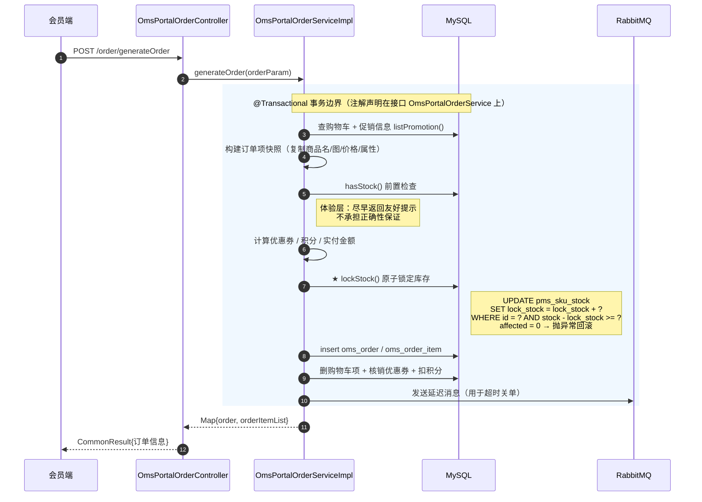
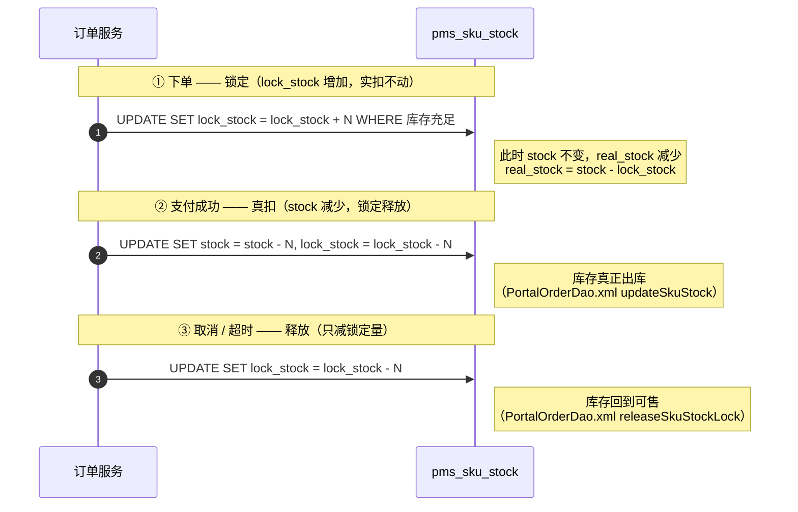

# mall 并发改造说明

> 本项目基于 [macrozheng/mall](https://github.com/macrozheng/mall) 进行复健学习，
> 在阅读下单链路源码时发现并修复了一个**库存锁定的并发缺陷**。
> 本文记录问题的发现过程、改造方案与验证数据。

---

## 一、发现的问题

### 现象

`OmsPortalOrderServiceImpl.lockStock()`（原 734-740 行）采用 **read-modify-write** 写法：

```java
private void lockStock(List<CartPromotionItem> cartPromotionItemList) {
    for (CartPromotionItem cartPromotionItem : cartPromotionItemList) {
        PmsSkuStock skuStock = skuStockMapper.selectByPrimaryKey(cartPromotionItem.getProductSkuId());
        skuStock.setLockStock(skuStock.getLockStock() + cartPromotionItem.getQuantity());  // 内存累加
        skuStockMapper.updateByPrimaryKeySelective(skuStock);                              // 写回绝对值
    }
}
```

### 为什么它是错的

并发下两个事务会互相覆盖：

```
T1: SELECT lock_stock → 读到 0
T2: SELECT lock_stock → 读到 0          ← 都读到旧值
T1: 内存计算 0 + 1 = 1
T2: 内存计算 0 + 1 = 1                  ← 各自在 Java 里加
T1: UPDATE lock_stock = 1      ✅
T2: UPDATE lock_stock = 1      ← 覆盖了 T1 的结果
```

**结果：`lock_stock` 只记 1，但实际锁定了 2 件 → 少锁 → 超卖风险。**

### 四条静态证据

| 检查项 | 结果 |
|---|---|
| `selectByPrimaryKey` 是否加锁 | 普通 `select ... where id = ?`，**无 `FOR UPDATE`** → 快照读，不参与行锁 |
| `updateByPrimaryKeySelective` 的条件 | `where` 仅 `id = #{id}`，写入**绝对值** `lock_stock = #{lockStock}` |
| 表是否有 version 字段 | `pms_sku_stock` 仅 11 个字段，**无 `version`** → 无法用乐观锁 |
| **同项目是否有正确写法** | `PortalOrderDao.xml:50-67` 用的是 `SET stock = stock - #{qty}`（原子运算）→ **风格不一致即遗漏证据** |

### 还有第二个问题：检查与使用之间存在时间窗

```java
if (!hasStock(cartPromotionItemList)) {    // 第 124 行：先检查
    Asserts.fail("库存不足，无法下单");
}
// ……中间隔了约 40 行（优惠券、积分、金额计算）……
lockStock(cartPromotionItemList);          // 第 165 行：后锁定
```

并发下会出现「检查时够、锁定时不够」。

---

## 二、下单链路时序图

### 2.1 下单主流程（含事务边界）



### 2.2 库存三段式（这是理解库存设计的关键）



> **`real_stock = stock - lock_stock`** 才是用户看到的可售库存。
> 这也是为什么 `lock_stock` 变成负数会**虚增**可售库存（见下方"同类缺陷"）。

---

## 三、改造方案

### 3.1 新增 Mapper 方法（`PmsSkuStockMapper`）

```xml
<!-- 原子锁定库存：条件与更新在同一条 SQL 内完成 -->
<update id="lockSkuStock">
    UPDATE pms_sku_stock
    SET lock_stock = lock_stock + #{quantity}
    WHERE id = #{skuId}
      AND stock - lock_stock &gt;= #{quantity}
</update>
```

```java
int lockSkuStock(@Param("skuId") Long skuId, @Param("quantity") Integer quantity);
```

### 3.2 改造调用点（`OmsPortalOrderServiceImpl#lockStock`）

```java
private void lockStock(List<CartPromotionItem> cartPromotionItemList) {
    for (CartPromotionItem cartPromotionItem : cartPromotionItemList) {
        // 原子更新：库层完成「库存够才锁定」，不再先查后写
        int affected = skuStockMapper.lockSkuStock(
                cartPromotionItem.getProductSkuId(),
                cartPromotionItem.getQuantity());
        if (affected == 0) {
            // 影响行数为 0 = 条件不满足 = 库存不足，抛异常触发事务回滚
            Asserts.fail("库存不足：" + cartPromotionItem.getProductName());
        }
    }
}
```

### 3.3 一条 SQL 同时解决两个问题

| 原问题 | 解法 |
|---|---|
| 丢失更新 | `lock_stock = lock_stock + ?` 是**数据库内原子运算**，不存在读改写覆盖 |
| 检查-使用时间窗 | `WHERE ... AND stock - lock_stock >= ?` 把**校验与更新合并**成一次原子操作 |
| 无失败反馈 | `affected rows == 0` 就是"库存不足"的信号，抛异常回滚 |
| 2N 次数据库往返 | 不再需要 `SELECT`，往返次数减半 |

---

## 四、验证

### 4.1 改造前的复现（证明问题真实存在）

用并发脚本复刻原写法（10 个连接用 Barrier 同时起跑）：

| 实验 | 写法 | 结果 |
|---|---|---|
| A | `SELECT` → 内存累加 → `UPDATE` 绝对值 | 10 个连接全部成功，`lock_stock` = **1**（丢 9 次） |
| B | 原子 SQL | 10 个连接全部成功，`lock_stock` = **10** ✓ |

> 脚本用 `SLEEP` 放大了时间窗以确保可复现。真实环境下窗口只有毫秒级，
> 所以这个问题**低并发时长期不暴露，压力上来才突然出现**——典型的偶发线上事故。

### 4.2 改造后的验收（真实 HTTP 并发下单）

通过 `/order/generateOrder` 接口并发压测，两个场景都验证：

| 场景 | 构造 | 成功 | 被拒 | `lock_stock` | 结论 |
|---|---|---|---|---|---|
| **A 库存充足** | stock=487，10 并发各买 1 件 | 10 | 0 | **10** | ✓ 不丢更新 |
| **B 库存不足** | stock=5，10 并发各买 1 件 | **5** | **5** | **5** | ✓ 不超卖 |

- 场景 B 中被拒的请求返回 `库存不足：压测商品`——**业务语义的提示，不是数据库报错**
- 场景 B 结束后 `real_stock = 0`，未发生超卖

**对照改造前**：场景 A 的 `lock_stock` 只记 1；场景 B 的 10 个请求**全部放行、不做任何拦截**。

---

## 五、同类缺陷（一并发现，未改造）

压测过程中还发现释放库存的 SQL **没有下限保护**，导致 `lock_stock` 被扣成负数：

```xml
<!-- PortalOrderDao.xml releaseSkuStockLock -->
UPDATE pms_sku_stock
SET lock_stock = lock_stock - #{item.productQuantity}
WHERE id IN (...)        <!-- 没有 lock_stock >= qty 的下限校验 -->
```

**实测数据**（改造前的库中真实存在）：

| SKU | stock | lock_stock | 虚增后的 real_stock |
|---|---|---|---|
| 98 | 86 | **-24** | 110（实际只有 86） |
| 102 / 103 / 106 | 99 | **-8** | 107 |

`real_stock = stock - lock_stock`，负的锁定库存会**虚增**可售量——本来用于保护库存的字段，反而放大了超卖风险。

**建议改法**：加 `AND lock_stock >= #{quantity}`，并对 `affected rows == 0` 的情况打告警日志（那说明发生了重复释放）。

> 这与上面的锁定问题是**同一类问题的两面**：下单"加"会丢更新（少加），取消"减"没有下限（多减）。

---

## 六、面试要点

### 为什么不用 `SELECT ... FOR UPDATE`？

悲观锁会持有行锁直到事务提交。下单事务里还有优惠券核销、积分扣减、发送延迟消息等操作，
锁持有时间长、并发吞吐下降明显。原子 `UPDATE` 的锁只在语句执行瞬间。

### 为什么不用 Redis 预扣减？

那是**秒杀量级**的方案，会引入缓存与数据库的一致性成本。
这个接口的并发量级下数据库原子操作已经够用——**方案要与量级匹配**。
真要做秒杀，再上 Redis + Lua 原子扣减 + MQ 异步落库。

### 改成原子 SQL 后，外面的 `hasStock()` 还要吗？

保留，但语义变了：它成为「快速失败的前置检查」，用于尽早返回友好提示。
真正的正确性保证在 SQL 的条件里。
**前置检查负责体验，数据库约束负责正确性。**

### 为什么不用批量 SQL 一次更新多个 SKU？

批量 `UPDATE ... CASE WHEN` 能减少往返，但 `affected rows` 是**总数**，
无法定位是哪个 SKU 库存不足，只能整体回滚、报不出具体原因。
一次下单商品数通常是个位数，用少量性能换精确的错误定位更划算。

---

## 附：相关文件

| 文件 | 说明 |
|---|---|
| `mall-mbg/src/main/resources/com/macro/mall/mapper/PmsSkuStockMapper.xml` | 新增 `lockSkuStock` 原子 SQL |
| `mall-mbg/src/main/java/com/macro/mall/mapper/PmsSkuStockMapper.java` | 新增方法声明 |
| `mall-portal/.../OmsPortalOrderServiceImpl.java` | `lockStock` 改为原子调用 |
| `docs/lab/lockstock_verify.py` | 双场景验证脚本（含防超卖） |
